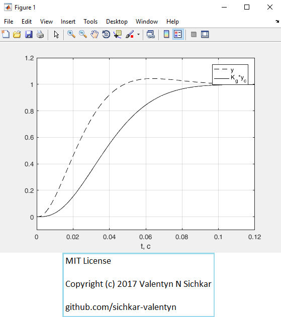
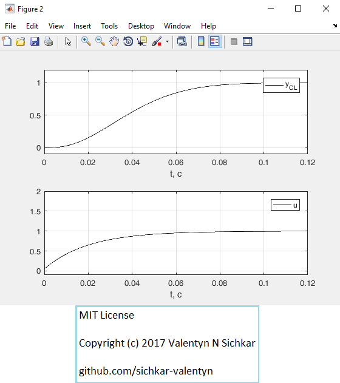
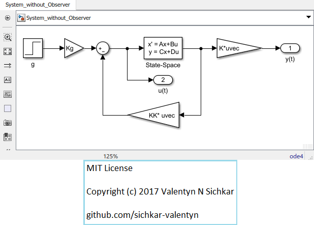

# Synthesis of SS Controller
Synthesis of SS Controller in Matlab using Simulink

### Reference to:
[1] Valentyn N Sichkar. Synthesis of SS Controller in Matlab using Simulink // GitHub platform [Electronic resource]. URL: https://github.com/sichkar-valentyn/Synthesis_SS_Controller (date of access: XX.XX.XXXX)

## Description
Synthesis of SS Controller in Matlab using Simulink.
 1) Plant simulation.
 2) Controller synthesis with place function.
 3) Simulation of closed-loop system.
 4) Simulation of the system using Simulink model.

## Plant Simulation

## Simulation of closed-loop system

## Simulation of the system using Simulink model

## MIT License
## Copyright (c) 2017 Valentyn N Sichkar
## github.com/sichkar-valentyn
### Reference to:
[1] Valentyn N Sichkar. Synthesis of SS Controller in Matlab using Simulink // GitHub platform [Electronic resource]. URL: https://github.com/sichkar-valentyn/Synthesis_SS_Controller (date of access: XX.XX.XXXX)
